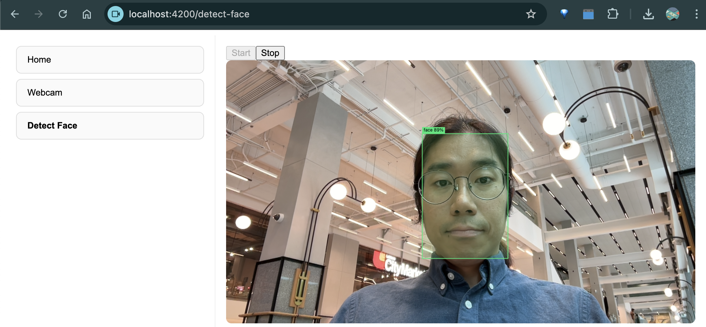
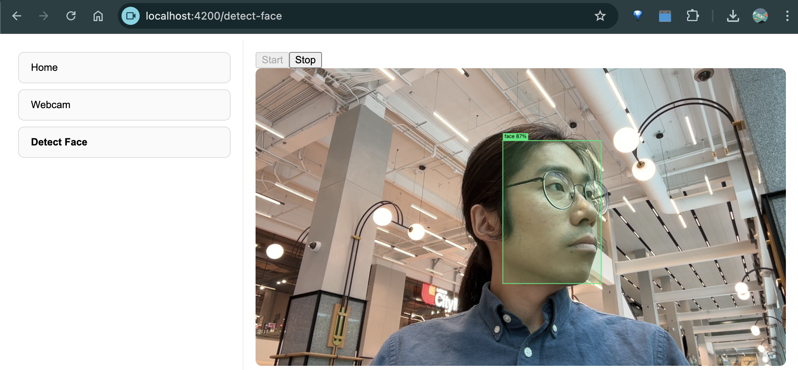

# Face Detection in Angular with ONNX Runtime Web

This project demonstrates how to run a **real-time face detection model** in an Angular application using **ONNX Runtime Web (ort-web)**.  
It captures webcam input, runs inference with an ONNX model, and overlays bounding boxes directly on top of the video stream.
---
## Demo Result



---

## Features
- Real-time webcam streaming in Angular
- ONNX Runtime Web inference with WASM backend
- Bounding box overlay with live confidence scores
- Start/Stop control for inference loop
- Fully client-side (no backend required)

---

## Project Structure
```
src/
 ├── app/
 │   └── ...
 ├── assets/
 │   ├── model.onnx               # Your ONNX face detection model
 │   └── ort/                     # ONNX Runtime Web wasm files
 │        ├── ort-wasm-simd-threaded.jsep.mjs
 │        ├── ort-wasm-simd.wasm
 │        └── ...
```

---

## Setup & Installation
1. Clone the repository:
   ```bash
   git clone https://github.com/co24428/face_detection_web
   cd face_detection_web
   ```

2. Install dependencies:
   ```bash
   npm install
   ```

3. Copy the ONNX Runtime Web files into `src/assets/ort/`.  
   You can get them from the [ONNX Runtime Web release page](https://github.com/microsoft/onnxruntime/releases).

4. Add your model file (e.g. `model.onnx`) into `src/assets/`.

5. Start the Angular dev server:
   ```bash
   ng serve
   ```

6. Open the app in your browser:
   ```
   http://localhost:4200
   ```

---

## How It Works
- A hidden `<video>` element receives webcam input.
- Two `<canvas>` elements are layered:
  - **Background canvas**: renders video frames
  - **Overlay canvas**: draws detection results (bounding boxes & labels)
- ONNX Runtime Web processes the video frames and outputs detection results.
- The bounding boxes are updated per frame in sync with the video.

---

## Troubleshooting
- **Error: Failed to resolve module specifier `ort-wasm-simd-threaded.jsep.mjs`**  
  → Ensure the ONNX Runtime `.mjs` and `.wasm` files are copied into `assets/ort/` and paths are correct in your code.

- **Error: Failed to load model because protobuf parsing failed**  
  → Check that your `.onnx` file is valid and accessible under `assets/`.

- **Bounding boxes appear separate from video**  
  → Verify your CSS uses `position: absolute` for the overlay canvas.


